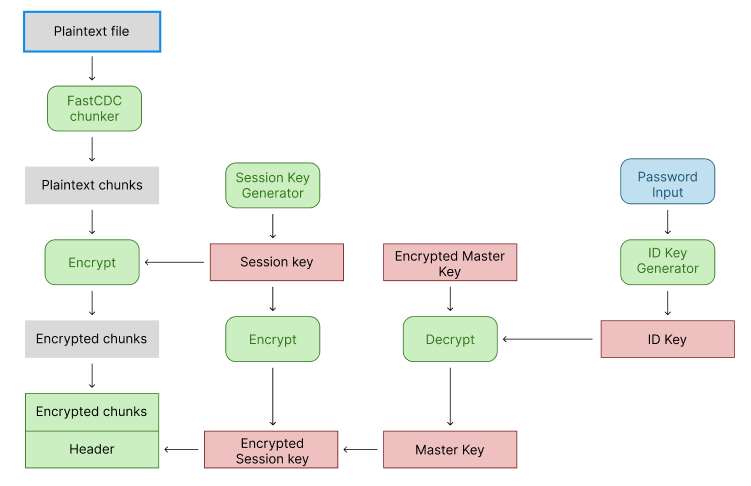

# warden

## Design

### Encryption/Decryption

- XChaCha20-POLY1305 authenticated encryption with associated data (AEAD)

  - XChaCha20: version of Google's ChaCha20 symmetric key encryption algorithm

    - generates a psuedo-random stream of bits (key stream) that's XOR'd with the plaintext to create random ciphertext
    - key stream is generated from encryption key and nonce
    - X version of ChaCha20 allows random nonce generation

  - POLY1305: message authenticated code (MAC) algorithm for validating encrypted data has not been modified

    - takes encrypted message, associated data, nonce, and secret key as inputs and produces MAC
    - on encryption, MAC is appended to the ciphertext
    - on decryption, MAC is derived and compared to the appended MAC to ensure zero modification

- Password derived keys
  - Argon2id: password hashing algorithm
  - 2 keys per user: file encryption key and key encryption key
    - file encryption key randomly generated and stored encrypted in ciphertext header
    - master encryption key derived from password and used to decrypt file encryption key
    - password change requires only decrypting and re-encrypting master key instead of all data

### File Chunking

- [FastCDC](https://www.usenix.org/system/files/conference/atc16/atc16-paper-xia.pdf) content-driven chunking strategy for data deduplication

  - optimizes hash for chunking by using increased zero padding to mimic Rabin-based CDC sliding window
  - enlarges minimum chunk sized for higher CDC speed
  - normalized chunking to reduce chunks with sizes at the poles

## TODO

- [ ] open repository with a password
- [ ] print repository master key
- [ ] write repository config
- [ ] print repository config

## Commands

| Command | Description                                                   |
| ------- | ------------------------------------------------------------- |
| init    | Create a new encrypted backup store                           |
| show    | Print resource information (see appendix for valid resources) |

### Appendix

- valid resources: masterkey, config
